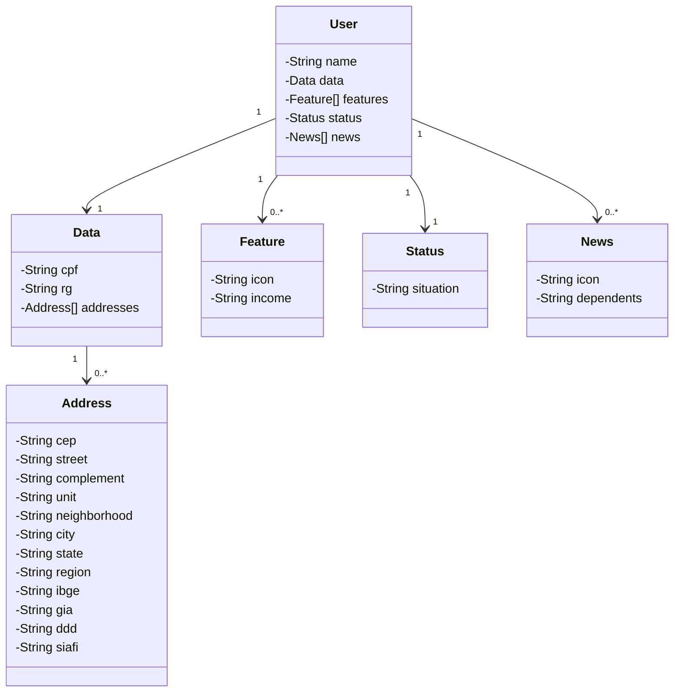

# Cadastro de Usuário

## Diagrama de Classes

```mermaid
classDiagram
    class User {
        -String name
        -Data data
        -Feature[] features
        -Status status
        -News[] news
    }

    class Data {
        -String cpf
        -String rg
        -Address[] addresses
    }

    class Address {
        -String cep
        -String street
        -String complement
        -String unit
        -String neighborhood
        -String city
        -String state
        -String region
        -String ibge
        -String gia
        -String ddd
        -String siafi
    }

    class Feature {
        -String icon
        -String income
    }

    class Status {
        -String situation
    }

    class News {
        -String icon
        -String dependents
    }

    User "1" --> "1" Data
    Data "1" --> "0..*" Address
    User "1" --> "0..*" Feature
    User "1" --> "1" Status
    User "1" --> "0..*" News
```
